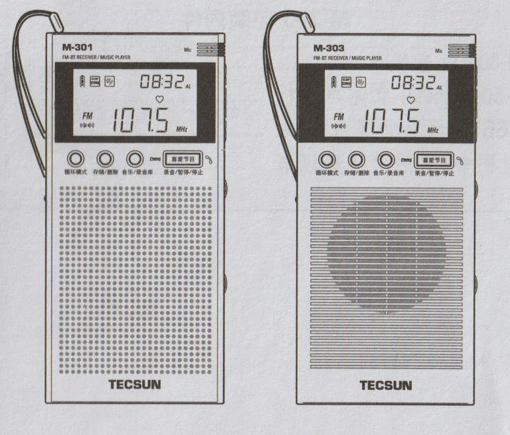
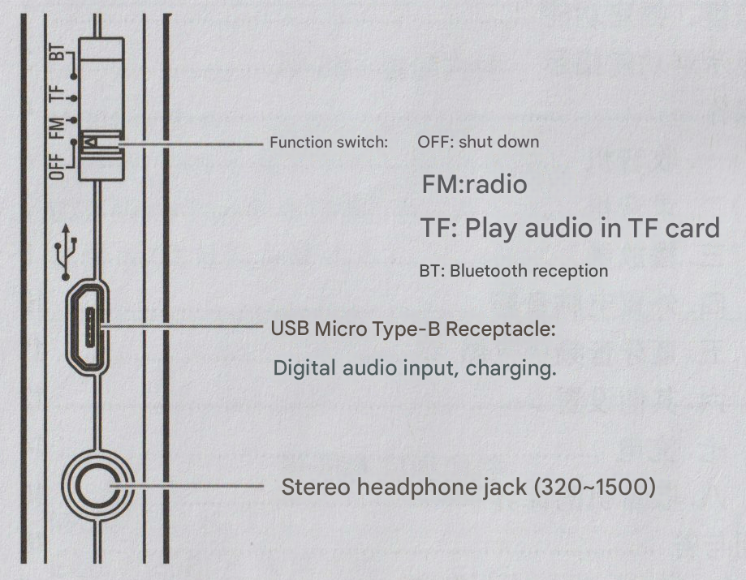
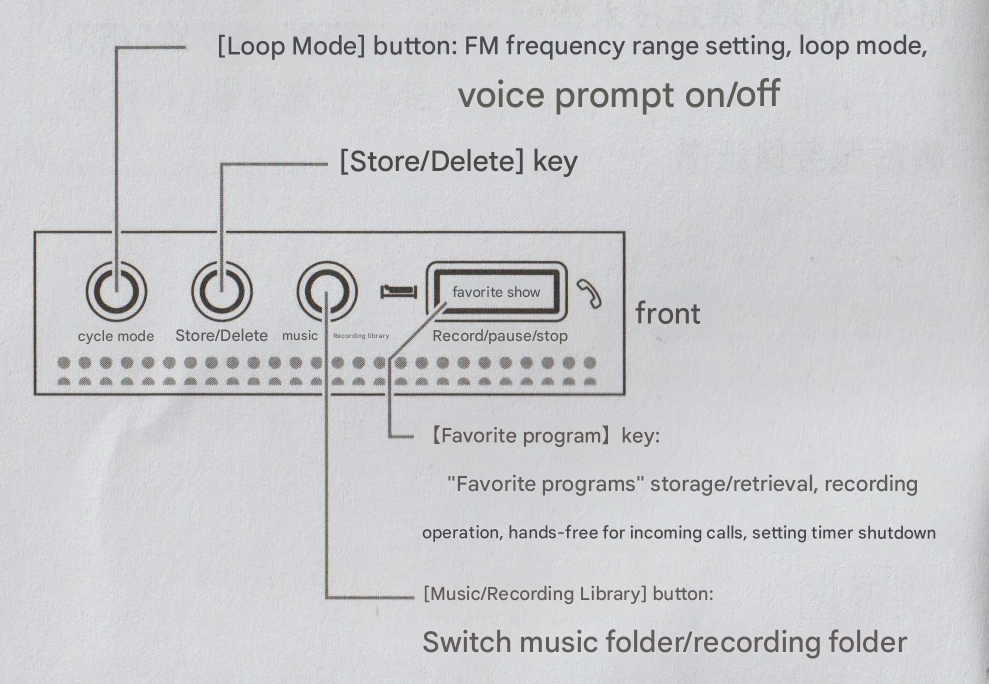
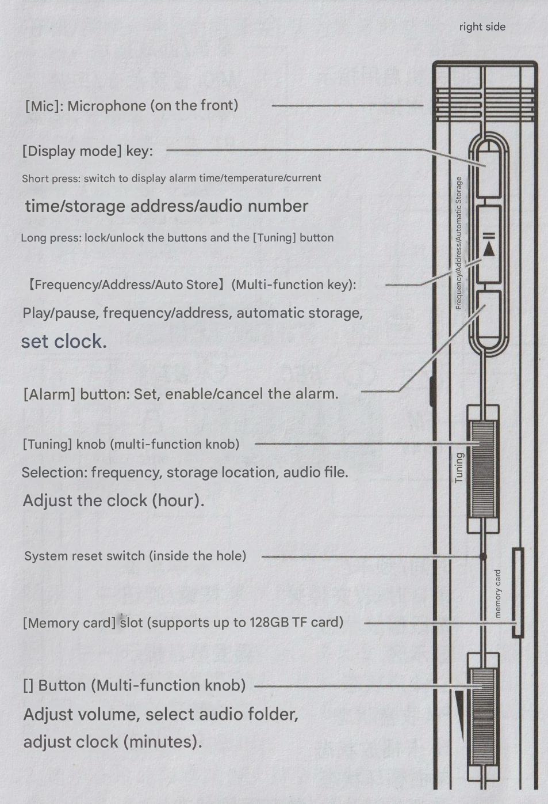
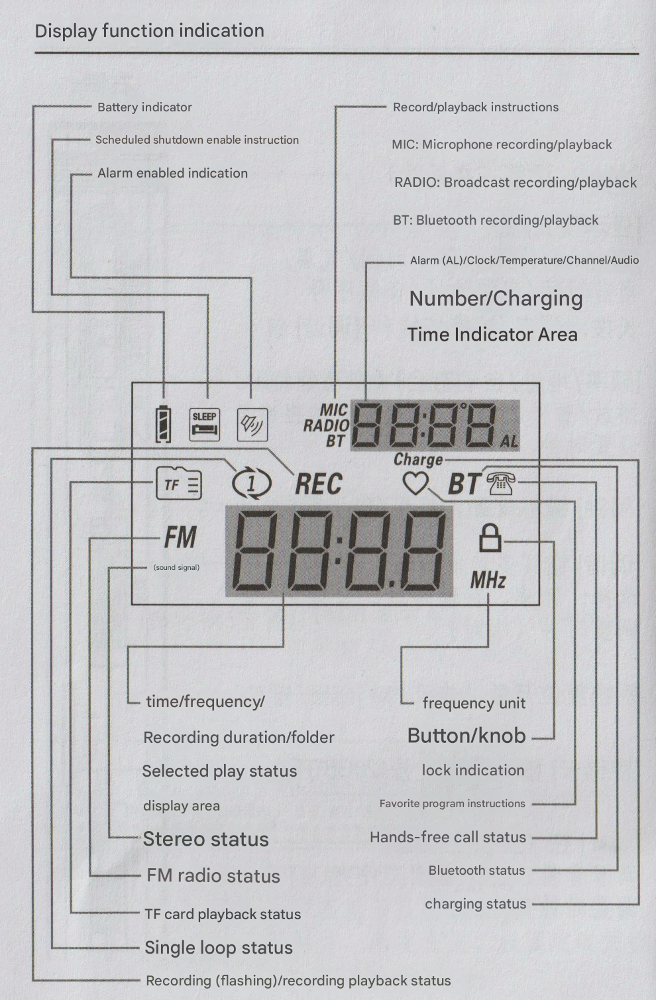
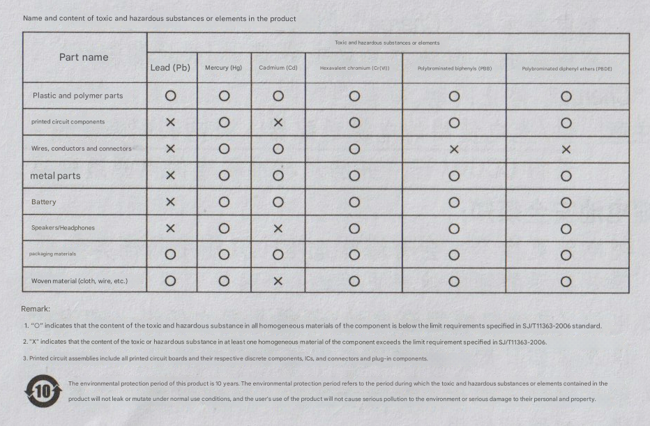

# Tecsun M-301/M-303 User Manual

## FM • Bluetooth Receiver • Music Player

*English Translation of Manual for Tecsun M-301 and M-303*

**Please read carefully before use and keep properly**

---

## Package Contents

### M-301 Package Contents:
- M-301 Radio .................................................. 1
- E-50 Type (50Ω) Stereo Earphones ............................. 1
- USB Micro Type-B Data Cable .................................. 1
- User Manual/After-sales Service Certificate .................. 1

### M-303 Package Contents:
- M-303 Radio .................................................. 1
- E-50 Type (50Ω) Stereo Earphones ............................. 1
- USB Micro Type-B Data Cable .................................. 1
- User Manual/After-sales Service Certificate .................. 1

---

## Table of Contents

1. [Button and Socket Functions](#button-and-socket-functions)
2. [Display Function Instructions](#display-function-instructions)
3. [Operations](#operations)
   - [Radio](#1-radio)
   - [Recording](#2-recording)
   - [Player](#3-player)
4. [External Computer Audio Box](#4-external-computer-audio-box)
5. [Bluetooth Audio Receiver](#5-bluetooth-audio-receiver)
6. [Other Settings](#6-other-settings)
7. [Charging](#7-charging)
8. [Radio Maintenance](#8-radio-maintenance)
9. [FAQ](#faq)
10. [Technical Specifications](#m-301m-303-basic-technical-specifications)
11. [After-sales Service Certificate](#after-sales-service-certificate)

---

## Button and Socket Functions

### Left Side

- **Function Switch:**
  - OFF: Power off
  - FM: Radio
  - TF: Play TF card audio
  - BT: Bluetooth connection
- **USB Micro Type-B Socket:** For digital audio input and charging
- **Stereo Earphone Jack** (32Ω ~ 150Ω)

### Front Panel

- **[Loop Mode] Button:** FM frequency range setting, loop mode, power on/off language prompt
- **[MEM./DEL.] Button** (Memory/Delete)
- **[FAVORITE] Button:** Favorite track function for "Favorites" storage/retrieval, recording operation, audio file extraction, set clock
- **[FOLDER] Button:** Switch music files/recording files

### Right Side

- **[Mic]:** Microphone (on front panel)
- **[Display Mode] Button:**
  - Short press: Switch display (clock time/temperature/current time/storage location/audio track number)
  - Long press: Lock/unlock buttons and [tuning] knob
- **[Frequency/Location/Auto Store]** (Multi-function button):
  - Play/pause, frequency/location, auto store, set clock
- **[Clock] Button:** Settings, start/cancel alarm
- **[Tuning] Knob** (Multi-function knob):
  - Select: Frequency, storage location, audio files
  - Adjust clock (hours)
- **System Reset Switch** (inside hole)
- **[Storage Card] Slot** (Supports up to 128GB TF card)
- **[◀] Knob** (Volume/Multi-function knob):
  - Adjust volume, select audio files
  - Adjust clock (minutes)

---

## Display Function Instructions

The LCD display includes the following indicators:

- **Battery Level Indicator**
- **Clock Start Indicator**
- **Clock Alarm Indicator**
- **Recording/Playback Indicator:**
  - MIC: Microphone recording/playback
  - RADIO: Radio recording/playback
  - BT: Bluetooth recording/playback
- **Clock (AL)/Time/Temperature/Channel/Audio Track Number/Charging Time Display Area**
- **Time/Frequency/Recording Time Length/File Selection Playback Status Display Area**
- **Stereo Status**
- **FM Radio Status**
- **TF Card Playback Status**
- **Single Track Loop Status**
- **Recording (Flash)/Recording Playback Status**
- **Frequency Unit**
- **Button/Knob Lock Indicator**
- **Favorite Track Indicator**
- **Hands-free Call Status**
- **Bluetooth Status**
- **Charging Status**

---

## Operations

### Power On/Off
Turn [Function Switch] to desired function:
- FM: FM radio tuning
- TF: Play TF card audio
- BT: Bluetooth connection
- OFF: Power off

### Volume Adjustment
Turn [◀] knob to adjust volume.

### Using Earphones
Connect to 32Ω ~ 150Ω stereo earphones.

> **Note!** Lower volume first, then plug in earphones and adjust volume gradually to avoid hearing damage.

> **Tips:** After plugging in earphones, volume will automatically adjust to the appropriate level. After unplugging earphones, original volume is restored.

### Language Prompt On/Off
1. Turn [Function Switch] to FM
2. Long press [Loop Mode] button
   - Display On: Language prompt on
   - Display OFF: Language prompt off

---

## 1. Radio

> **Note:** This device has a built-in FM antenna.

### Frequency Range Setting (operates in OFF mode):
1. Long press [Loop Mode] button, then repeatedly short press (or turn [Tuning] knob) to select frequency range. Display shows 64, 76, 87, 88, indicating frequency ranges: 64~108MHz, 76~108MHz, 87~108MHz, 88~108MHz
2. After selecting appropriate frequency range, wait 2 seconds to auto-confirm

> **Note:** Temperature unit - At 88~108MHz frequency range, external temperature is Fahrenheit (°F), others are Celsius (°C).

### Radio Mode Entry
Turn [Function Switch] to FM

### Select Frequency
Turn [Tuning] knob

### VF/VM Switch
Short press [Frequency/Location/Auto Store] button

This device searches for radio frequencies in two ways: Tuning Frequency (VF) and Memory Storage Frequency (VM).

After short pressing [Frequency/Location/Auto Store] button:
- When frequency flashes, in VF state
- Display shows top left corner channel number flash, in VM state

> **Note:** If no storage frequency, entering VM state, channel number shows "P0--", automatically returns to VF state.

### Storage Frequency (operates in VF state)

**Method 1 - Auto Store:**
Long press [Frequency/Location/Auto Store] button to auto scan and store radio frequencies.

**Method 2 - Manual Store:**
1. Turn [Tuning] knob to select frequency
2. Short press [MEM./DEL.] button, channel number flashes
3. Turn [Tuning] knob to select channel
4. Short press [MEM./DEL.] button to confirm

> **Note:**
> - If no storage channels selected, steps 3, 4 can be skipped. Step 2, continuously short press [MEM./DEL.] button twice
> - If more frequency coverage required, stored frequencies won't be deleted

### Listen to Pre-stored Radio Frequencies
1. Short press [Frequency/Location/Auto Store] button to enter VM state
2. Turn [Tuning] knob to select frequency

### Delete Pre-stored Frequencies (operates in VM state)

**Method 1 - Select Delete:**
1. Turn [Tuning] knob to select frequency to delete
2. Long press [MEM./DEL.] button, display shows flashing dEL
3. Short press [MEM./DEL.] button, selected frequency is deleted

**Method 2 - Delete All Pre-stored Frequencies:**
1. Long press [MEM./DEL.] button until display shows flashing P0 dEL
2. Short press [MEM./DEL.] button, wait for display to show frequency, all pre-stored frequencies deleted

### Auto-Sort Stored Frequencies (operates in OFF state)
Long press [FOLDER] button

Display shows top left corner flashing P0C, indicates stored frequency being auto-sorted. After sorting complete, displays time or temperature.

### Set Regular Listening to Radio Frequency
1. Select frequency
2. Short press [MEM./DEL.] button, channel number flashes
3. Short press [FAVORITE] button, ♡ symbol flashes
4. Short press [MEM./DEL.] button, ♡ disappears, selected frequency set

During listening, short press [FAVORITE] button to jump to "regular listening frequency" (display shows ♡). Short press [FAVORITE] button again to return to original listening frequency (♡ disappears).

> **Note:** "Favorites" can only set one frequency and one audio track, set another replaces original.

When using earphones for radio, display shows (♫♫), indicates radio broadcasting stereo. If radio uses mono broadcast, or signal weak, stereo broadcast naturally switches to mono broadcast, but signal weak, (♫♫) won't display. When using speaker for radio, defaults to mono, (♫♫) won't display.

---

## 2. Recording

M-301, M-303 have recording function:
- In radio mode: Records radio programs
- In player mode: Uses built-in microphone for recording
- In Bluetooth mode: Records audio from devices transmitting audio

> **Note:**
> 1. Must insert TF card before recording
> 2. In Bluetooth mode, can only record audio from Bluetooth transmitting devices, cannot record phone calls

### Recording
Long press [Recording/Pause/Stop] button

Display shows recording time and flashing "REC"

> **Note:**
> 1. Recording radio programs displays "RADIO"
>    Using microphone recording displays "MIC"
>    Recording Bluetooth audio displays "BT"
> 2. Microphone recording volume differs from audio source volume
> 3. During microphone recording, do not rotate knob to avoid noise
> 4. Each recording file maximum length 1 hour. If recording exceeds 1 hour, automatically generates another recording file

### Pause Recording
Short press [Recording/Pause/Stop] button

Recording paused, "REC" stops flashing, recording time stops

### Continue Recording
Short press [Recording/Pause/Stop] button again

Recording continues, "REC" flashes, recording time runs

### Stop Recording
Long press [Recording/Pause/Stop] button

Stop recording and play recording just recorded

### Exit Recording
After stopping recording, short press [Recording/Pause/Stop] button

---

## 3. Player

Supports 16bit/44.1k FLAC/WAV/WMA/APE and MP3 format audio files. Player supports single track repeat.

1. Insert TF card with audio into [Storage Card] slot
2. Turn [Function Switch] to "TF" position. Display shows ▶, starts playing audio in card

> **Note:** If TF card has no audio files, or card audio files not supported format, display shows -NO-.

### Switch Music/Recording Files Library
Long press [FOLDER] button

Language prompt "TF card mode" or "Recording playback"

### Playback Control:
- **Select Files:** (If no files, ignored)
  1. Short press [FOLDER] button to enter file selection state, displays the file's audio track number and file number, e.g.: 28 A 01.
  2. Turn [◀] (volume) knob to select file
  3. Short press [FOLDER] button to exit file selection state
- **Select Audio:** Turn [Tuning] knob
- **Pause/Play:** Short press [Frequency/Location/Auto Store] button
  In pause state, display ‖.
- **Single Track Loop Play:** Long press [Loop Mode] button. Display ①, enters single track loop play state
  Exit single track loop play state: Long press [Loop Mode] button. ① disappears.
- **Select Loop Play:**
  1. When playing fragment start required, short press [Loop Mode] button, display shows A--.
  2. At fragment end, short press [Loop Mode] button. Display A--B.

### Select Audio Fragment for Repeat Play
Exit select play state: Short press [Loop Mode] button

### Set Audio as "Favorites":
1. Select audio
2. Short press [MEM./DEL.] button, audio track number flashes
3. Short press [FAVORITE] button, ♡ symbol flashes
4. Short press [MEM./DEL.] button, ♡ disappears, selected audio set

### Extract "Favorites":
In TF card mode, short press [FAVORITE] button

If "Favorites" set in player, display shows ♡, audio track number in file folder.

### Exit "Favorites":
Short press [FAVORITE] button

Return to previously played audio (♡ symbol disappears).

> **Note:** Audio stored in recording library cannot be set as "Favorites".

### Recording Audio Playback:
1. Long press [FOLDER] button, player sends "Recording playback" prompt and plays recording files
2. Short press [FOLDER] button to enter file selection state
   Display file number, e.g.: A 01.
3. Turn [◀] knob to select recording file
   - Display "RADIO": Radio recording file
   - Display "BT": Bluetooth recording file
   - Display "MIC": Conference, interview recording file
4. Short press [FOLDER] button to exit file selection
5. Turn [Tuning] knob to select recording file

### Delete Audio Files (delete one by one)
1. Select file to delete
2. Long press [MEM./DEL.] button, display flashing dEL and file number
3. Short press [MEM./DEL.] button, selected audio file deleted
   Repeat above steps, delete unnecessary files

### Batch Delete Audio Files:
1. Power on
2. Connect to computer via USB Micro Type-B data cable and player
3. Enter computer "removable disk" related files or folders
   Including:
   - RECORDB: Bluetooth recording files
   - RECORDM: Conference, interview recording files
   - RECORDF: Radio recording files
4. Select files and delete

---

## 4. External Computer Audio Box

### Connect to Computer:
1. Power on
2. Connect computer and player with USB Micro Type-B data cable. Player automatically enters "PC mode", displays PC.
3. Turn on computer player software and play audio

### Playback Control:
- **Volume adjustment:** Turn [◀] knob
- **Select audio:** Turn [Tuning] knob
- **Pause/Play:** Short press [Frequency/Location/Auto Store] button

---

## 5. Bluetooth Audio Receiver

### Bluetooth Pairing:
1. Turn [Function Switch] to BT position, display ----.
2. Search "TECSUN M-301" (or "TECSUN M-303") in Bluetooth device list and pair.
   After successful pairing, display shows [·], can receive audio from Bluetooth device.

### Playback Control:
- **Volume adjustment:** Turn [◀] knob
- **Select audio:** Turn [Tuning] knob
- **Pause/Play:** Short press [Frequency/Location/Auto Store] button

### Hands-free Calling
If paired with Bluetooth device is mobile phone, when call comes in, player stops playing audio and reports phone number via voice. Display shows HF and phone icon.

> **Note:** This device doesn't support WeChat voice calls.

- **Answer call:** Short press [Frequency/Location/Auto Store] button
- **End call:** Short press [Frequency/Location/Auto Store] button

### Cancel Pairing:
Continuously short press [Frequency/Location/Auto Store] button twice.

---

## 6. Other Settings

### Set Sleep Timer:
1. Power on
2. Continuously short press [⬇] button twice, display shows flashing bell icon
3. Turn [Tuning] knob to set timer length (1~120 minutes, or On to cancel timer)
4. Short press [MEM./DEL.] button to confirm, or wait 2 seconds to auto-confirm
   Display shows bell icon, sleep timer function enabled

> **Note:** Sleep timer function only effective when set, automatically cancels after next power on.

### Set Clock Time (24-hour format):
1. Power off
2. Long press [Frequency/Location/Auto Store] button, clock "hour" position flashes
3. Turn [Tuning] knob to adjust "hour"
   Turn [◀] knob to adjust "minute"
4. Short press [Frequency/Location/Auto Store] button to confirm

### Set Alarm Clock:
1. Power off
2. Long press [Clock] button, display top right corner clock "hour" position flashes
3. Turn [Tuning] knob to adjust "hour"
   Turn [◀] knob to adjust "minute"
4. Short press [Clock] button to confirm, display shows flashing alarm clock
5. Turn [Tuning] knob to set alarm clock ring time (1~60 minutes)
6. Short press [Clock] button to confirm. Display shows alarm bell icon, alarm clock starts

### Alarm Clock Mode
This device alarm has "Radio Alarm" and "Music Alarm" two modes to choose

#### Radio Alarm:
1. Turn [Function Switch] to FM position
2. Select alarm radio frequency
3. Select alarm volume
4. Short press [MEM./DEL.] button, channel number flashes
5. Short press [Clock] button, bell icon flashes
6. Short press [MEM./DEL.] button, bell icon stops flashing immediately

#### Music Alarm:
1. Insert TF card with music files
2. Turn [Function Switch] to TF position
3. Select first music file as alarm music
4. Select alarm volume
5. Short press [MEM./DEL.] button, file number flashes
6. Short press [Clock] button, bell and music icons flash
7. Short press [MEM./DEL.] button, bell and music icons stop flashing immediately

> **Note:** After alarm, if short press [⬇] button, return to original state.

### Stop Alarm Function
Short press [Clock] button, bell icon disappears immediately.

### Display Mode
Repeatedly short press [Display Mode] button.
Display shows current time, alarm clock time, temperature, frequency (or audio track number).

### Button and [Tuning] Knob Lock and Unlock
Long press [Display Mode] button
- Display shows lock icon, buttons and [Tuning] knob locked
- Lock icon disappears, buttons and [Tuning] knob unlocked

### System Reset:
If "crash" phenomenon occurs, use toothpick or paper clip to press [System Reset Switch], system will reset.

---

## 7. Charging

When battery symbol shows low (empty battery icon), indicates low battery, please charge promptly.

Connect USB Micro Type-B cable to 5V DC charger into device side USB socket, can charge built-in polymer lithium battery. During charging, display top shows next charging time timer, charging indicator "Charge" flashes.

After full charge, battery symbol shows full (all segments lit), charging indicator "Charge" stops flashing.

> **Note!** Power adapters used for charging/power supply should be purchased and used by users, obtain CCC certification, and meet standard required power adapters.

### Lithium Battery Safety Notice:
1. Lithium batteries should not have explosion hazard when replaced! Only use same or equivalent lithium batteries for replacement.
2. Batteries (battery pack or combination batteries) must not be exposed to low temperature, humid, sun exposure, fire roasting or similar overheating environments.
3. Do not disassemble, impact, squeeze lithium batteries; if severe battery expansion or leakage occurs, discontinue use.
4. This device has built-in lithium battery. Follow aviation regulations, strictly prohibit this device in luggage check-in!

---

## 8. Radio Maintenance:

1. Avoid violent impact, falls and water ingress.
2. Do not place in direct sunlight, high temperature, humid places, also not in environments below -5°C, above +45°C use or store this device.
3. Do not spray perfume, hair spray or other liquids on radio to avoid this product being damaged by water drops or splashes. Do not place items like candles with naked flame sources on radio.
4. Avoid using corrosive chemical liquids to scrub radio surface.
5. Do not dismantle adjustment internal parts parameters by yourself.

### Hazardous Substances in Products Names and Content

**Notes:**
1. "O" indicates hazardous substance content in all homogeneous materials below SJ/T11363-2006 standard limit requirements.
2. "X" indicates hazardous substance content in at least one homogeneous material exceeds SJ/T11363-2006 standard limit requirements.
3. Printed circuit board components include printed circuit boards and their own polymer components, IC and connectors and plug-in components.

⑩ This product environmental protection use period is 10 years. Environmental protection refers to hazardous substance content in products under normal use conditions won't occur external leakage, won't cause environmental pollution or cause serious harm to users, property.

---

## FAQ

**Q: How long does charging take? How long can full battery be used?**
A: Battery fully discharged, charging takes about 2.5 hours. After full charge, if using speaker playback, moderate volume playback, can continuously work about 17 hours.

**Q: Can I use commercially available 9V/12V mobile phone quick chargers to charge?**
A: No, can only use 5V mobile phone chargers for charging.

**Q: When selecting frequency or audio, why does rotation need to be done twice?**
A: This is to prevent false touch causing rotation resulting in frequency hopping and audio file retrieval errors. If unfamiliar, can set yourself: In OFF mode, continuously short press [FAVORITE] button twice, display "OFF" to enable.

**Q: Why can't power on at FM (or: TF/BT) position, but display is off state?**
A: Two possibilities:
1. Excessive power consumption during playback, auto power off. Please charge promptly.
2. Used timer shutdown function once, radio auto powered off. Press function switch, can restore.

**Q: Why after inserting TF card, display shows -NO-?**
A: Three possibilities:
1. No audio files in card.
2. This device doesn't support card audio file format.
3. TF card damage.

**Q: Why when playing audio in TF card, turn [Tuning] knob, can only switch audio files, cannot adjust volume?**
A: Because player handles file selection state. Short press [FOLDER] button, exit file selection state.

**Q: Can loop play all audio files?**
A: No. Only supports single file loop music playback.

**Q: Why can't select files to play music?**
A: This device doesn't support multi-subfolder files.

**Q: What happens to favorite music settings after changing TF card?**
A: After changing TF card, or deleting music from card, original settings no longer work.

**Q: Why press button, no response (cannot record)?**
A: TF card inserted? No TF card, recording device won't work.

**Q: Recording time length limited?**
A: Default each recording file time maximum 1 hour. If recording exceeds 1 hour, device automatically generates another recording file.

**Q: How long can a 1GB TF card store recordings?**
A: Bluetooth recording, 1GB can store recording about 16 hours.
Radio recording, 1GB can store recording about 25 hours.
Microphone recording, 1GB can store recording about 35 hours.

**Q: Can recording files be set as "Favorites"?**
A: No.
If you want a recording file set as "Favorites", first use computer to move this recording file from recording folder, then you can set this recording audio as "Favorites".

**Q: Why is the [Tuning] knob lock function not working?**
A: Because player handles file selection state. Short press [FOLDER] button, exit file selection state.

---

## M-301/M-303 Basic Technical Specifications

| Specification | Value |
|--------------|-------|
| 1. Tuning Frequency Range: | 64~108MHz (Configurable) |
| 2. Tuning Sensitivity (S/N=30dB): | Better than 3μV |
| 3. Tuning Selectivity: | >60dB |
| 4. Memory Storage Rate: | 100 |
| 5. Supported Audio Formats: | 16bit/44.1k FLAC/WAV/WMA/APE and MP3 |
| 6. TF Card Specification: | Maximum support 128GB |
| 7. Recording Format: | FM and Mic: Mono WAV BT: Stereo MP3 |
| 8. Bluetooth Version: | BT 5.0 |
| 9. Stereo Earphone Impedance: | 32~150Ω |
| 10. Speaker: | 16Ω, 0.5W |
| 11. Maximum Operating Current: | 260mA |
| 12. Quiescent Current (Tuning): | <50mA |
| 13. Standby Current: | <100μA |
| 14. Power Supply: | 3.7V (Built-in polymer lithium battery) Or: External DC 5V |
| 15. Charger/Power Adapter (Purchased Separately): | 5V — 500mA |
| 16. Physical Dimensions (Without Strap): | 125 × 62 × 13 mm |
| 17. Net Weight: | Approximately 92g (M-301) 93g (M-303) |

**Product Standard Number:** Q/DS 1

---

## After-sales Service Certificate

### Dear User:

Thank you for choosing Desheng products. Our company's products are sold and serviced through our Three Guarantees service. Under normal use, if quality issues or malfunctions occur with the product, you can enjoy the following services with your receipt or device ID number:

1. Within 7 days from purchase date, if product malfunctions occur, users can choose to return, exchange, or repair at the point of purchase.

2. From day 8 to day 15 from purchase date, if product malfunctions occur, users can choose to exchange or repair at the point of purchase.

3. Within the Three Guarantees validity period, if product malfunctions occur, users enjoy free repair service.

4. Complete device has a Three Guarantees validity period of six months.

### The following situations are not covered by the Three Guarantees:
1. Unauthorized repair, disassembly, or modification causing malfunction.
2. Use of the product not in accordance with the manual requirements, resulting in damage to maintenance, care.
3. Damage caused by improper use by the user, such as dropping, squeezing, liquid immersion, etc.
4. Exceeding the Three Guarantees validity period.
5. Damage caused by force majeure.
6. Accessories such as chassis and earphones are not provided free warranty repair.

### Repair Methods:
1. Users can perform repairs at Desheng Radio Service Centers or designated repair points.
2. Users can perform repairs at the point of purchase in the region where there are designated repair points, or no local repair at the time, please send the product by mail to our company for repair.
3. Within the Three Guarantees validity period, warranty repairs are free but shipping costs may apply. After the Three Guarantees validity period expires, users pay for shipping costs, parts, and repair costs.

**Mailing Address:** No. 189, Rongchang Road, Dongcheng District, Dongguan City, Guangdong Province
Desheng Company Customer Service Department

**Postal Code:** 523071

Our company has received the package, within a week for repair and return to users.

### Desheng Appliance Service Points

#### Dongguan Desheng Radio Service Center
Phone: 0769-2316 7118
Address: No. 189, Rongchang Road, Dongcheng District, Dongguan City

#### Beijing Dayue Electronics Co., Ltd.
Phone: 010-8411 1581
Address: Beijing Dongcheng District, Andingmen Wai (Shanglongjia Garden) Shanglong West Lane 41 Building 3 Unit 2-2 Room

#### Shenyang Jinshida Trading Co., Ltd.
Phone: 024-2290 3243, 2481 5181
Address: No. 5, Gate 6, Hanlin Road, Shenhe District, Shenyang City

#### Tianjin Hongqiao District Jinghua Audio Equipment Business Department
Phone: 022-8773 2561
Address: First Floor B District No. 10, Tianjin Tianyuan Shopping Mall, Hongqiao District, Tianjin

#### Qingdao Xinlilai Trading Co., Ltd.
Phone: 0532-8495 5688
Address: No. 9-15, Sifang South Road, Sifang District, Qingdao City

#### Qingdao Xinercheng Trading Co., Ltd.
Phone: 0532-8876 8969
Address: No. 14, Yiwu Building, Hubei Road, South District, Qingdao City

#### Shijiazhuang Baijia Appliance Wholesale Department
Phone: 0311-8081 5395
Address: Building E, District 45, Dahe Electronic City, Xinhua District, Shijiazhuang City

#### Shijiazhuang Daoren Trading Co., Ltd.
Phone: 0311-8520 9417
Address: East of Building D, District 43, Dahe Electronic City, Xinhua District, Shijiazhuang City

#### Zhengzhou Guolong Electric
Phone: 0371-6693 3627
Address: East Gate 2B-061, Electronic Building, Xinzheng Huafu City, New District, Zhengzhou City

#### Jiangsu Nanjing Bond Trading Co., Ltd.
Phone: 025-8465 0453, 8465 0427
Address: Room 1111, International Building, No. 198, Zhongshan East Road, Baixia District, Nanjing City

#### Yangzhou Tiantian Electronics Headquarters
Phone: 0514-8734 2185
Address: No. 62, Ganhe South Road, Guangling District, Yangzhou City

#### Shanghai Desheng Electronics Technology Co., Ltd.
Phone: 021-5527 0937
Address: No. 1-10, 557 Lane, Sanmen Road, Baoshan District, Shanghai

#### Hangzhou Manbao Trading Co., Ltd.
Phone: 0571-8798 8153
Address: No. 67, Baojia Village, Dinglan Street, Jianggan District, Hangzhou City

#### Fuzhou Desheng Trading Co., Ltd.
Phone: 0591-8760 2798
Address: No. 136, Meiping Road, Gulou District, Fuzhou City
Century Garden, Building 10, Floor 1, Unit 01, Yalexuan Store, Floor 6

#### Guangzhou Liwan District Huirun Electronics Business
Phone: 020-8194 9777
Address: Room 226, Building 2, District 3, North of No. 155, Huangsha Avenue, Guangzhou City

#### Chengdu Desheng Electronics Trading Co., Ltd.
Phone: 028-8608 3088
Address: Chengdu Electronics Market, Chenghuang Temple Electronics Market (No. 11, Huayuan Road)
Jinfang Commercial Building B, Block 3, Floor 39

#### Lanzhou Jinde Electronics Co., Ltd.
Phone: 0931-8613929
Address: No. 1720, East Gangdong Road, Chengguan District, Lanzhou City
Xinglihua Garden Building 2, Unit 2, Room 102

#### Xinjiang Urumqi City Jingao Electronics Business Department
Address: First Floor, Building 093, National Trade Building, Urumqi

**Notice:** Each unit is subject to change, please do not notify separately.
Please consult Desheng company customer service department or check Desheng company website.

---

## Dongguan Desheng General Electric Manufacturing Co., Ltd.

Address: No. 189, Rongchang Road, Dongcheng District, Dongguan City, Guangdong Province
Postal Code: 523071
Phone: 0769-2316 7118     Fax: 0769-2316 0700
Website: www.tecsun.com.cn     E-mail: tecsun@tecsun.com.cn

September 2021, Second Edition